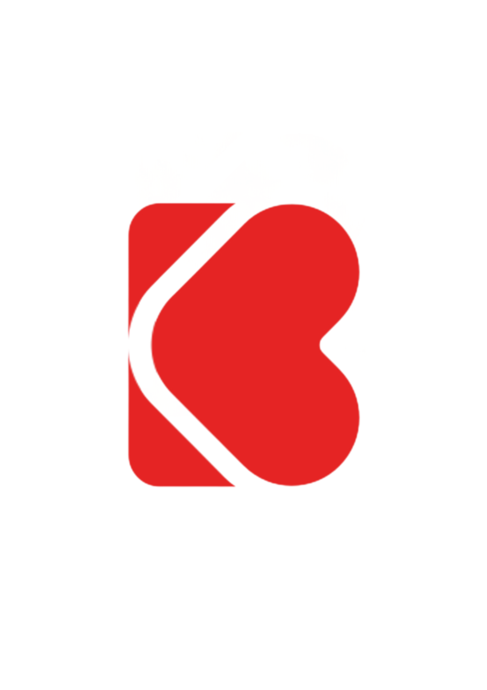

<html lang="fr">
<head>
<meta charset="utf-8" />
<meta name="viewport" content="width=device-width,initial-scale=1" />
<meta name="description" content="StaynB - Conciergerie Airbnb en Île-de-France. Gestion complète, accueil voyageurs, ménage, optimisation, estimation de revenus." />
<title>StaynB — Conciergerie Airbnb (Île-de-France)</title>

<!-- Fonts & icons -->
<link href="https://fonts.googleapis.com/css2?family=Montserrat:wght@500;700&family=Inter:wght@300;400;600&display=swap" rel="stylesheet">
<link rel="stylesheet" href="https://cdnjs.cloudflare.com/ajax/libs/font-awesome/6.5.0/css/all.min.css">

/* ✅ Correction d’affichage GitHub Pages */
html, body {
  margin: 0 !important;
  padding: 0 !important;
  width: 100%;
  max-width: 100%;
}

body > div {
  margin: 0 !important;
  padding: 0 !important;
  width: 100%;
  max-width: 100%;
}

section, header, footer {
  width: 100%;
  max-width: 100%;
  margin: 0 auto;
}

</head>

<body>

<!-- HEADER -->
<header>
  

    
    

      <h1>StaynB</h1>
      
Conciergerie • Île-de-France

    

  

</header>

<!-- HERO -->
<section class="hero" aria-label="Hero StaynB">
  <!-- ✅ Vidéo auto-hébergée à la place de YouTube -->
  

    <video autoplay muted loop playsinline poster="media/fallback.jpg">
      <source src="media/paris-bg.mp4" type="video/mp4">
      <source src="media/paris-bg.webm" type="video/webm">
      Votre navigateur ne supporte pas la vidéo.
    </video>
  

  

    

      <h2>Gérez vos locations sans stress — maximisez vos revenus et offrez une expérience mémorable.</h2>
      
StaynB prend en charge l'accueil, le ménage, la maintenance et l'optimisation de vos annonces en Île-de-France.

      

        <button class="btn btn-primary" id="ctaEstimate">Faire une estimation</button>
        <button class="btn btn-outline" id="ctaPacks">Voir les packs</button>
      

      

        

          
★

          

            
4.9/5

            
Note moyenne

          

        

        

          
⟳

          

            
+30%

            
Revenus optimisés (moy.)

          

        

      

    

    <aside class="hero-side" aria-label="Stats">
      

        
Revenu moyen/mois

        
1 650 €

      

      

        
Taux d’occupation

        
78 %

      

      

        
Clients satisfaits

        
+120

      

    </aside>
  

</section>

<!-- SERVICES -->
<section id="services" aria-label="Nos services" style="padding:80px 20px;background:var(--card)">
  

    <h2 style="font-family:Montserrat;font-size:2rem;margin-bottom:10px">Nos services</h2>
    
Une gestion complète de votre location courte durée, de l’annonce à l’entretien, avec transparence et efficacité.

    

      

        <i class="fa-solid fa-key" style="font-size:32px;color:var(--accent-2);margin-bottom:16px"></i>
        <h3 style="margin:0 0 10px">Check-in & Check-out</h3>
        
Accueil des voyageurs, remise des clés, et vérification de l’état du logement à chaque départ.

      

      

        <i class="fa-solid fa-broom" style="font-size:32px;color:var(--accent-2);margin-bottom:16px"></i>
        <h3 style="margin:0 0 10px">Ménage professionnel</h3>
        
Nettoyage complet et gestion du linge par nos équipes partenaires.

      

      

        <i class="fa-solid fa-chart-line" style="font-size:32px;color:var(--accent-2);margin-bottom:16px"></i>
        <h3 style="margin:0 0 10px">Optimisation des revenus</h3>
        
Ajustement dynamique des tarifs et des disponibilités selon la demande locale et la saison.

      

      

        <i class="fa-solid fa-comments" style="font-size:32px;color:var(--accent-2);margin-bottom:16px"></i>
        <h3 style="margin:0 0 10px">Support voyageurs 24/7</h3>
        
Réponses rapides et assistance aux voyageurs à toute heure.

      

    

  

</section>

<!-- PACKS -->
<section id="pricing" style="padding:80px 20px">
  

    <h2 style="font-family:Montserrat;font-size:2rem;margin-bottom:10px">Nos packs & tarifs</h2>
    
Choisissez la formule qui correspond à votre besoin. Aucune mauvaise surprise : nos tarifs sont transparents.

    

      

        <h3>Pack Essentiel</h3>
        
15 % de commission

        <ul style="list-style:none;padding:0;text-align:left;line-height:1.8">
          <li>✔ Accueil & remise des clés</li>
          <li>✔ Ménage & linge</li>
          <li>✔ Support voyageurs</li>
        </ul>
        <button class="btn btn-primary" style="margin-top:20px">Choisir</button>
      

      

        <h3>Pack Premium</h3>
        
20 % de commission

        <ul style="list-style:none;padding:0;text-align:left;line-height:1.8">
          <li>✔ Tous les services du pack Essentiel</li>
          <li>✔ Optimisation des prix</li>
          <li>✔ Photographies professionnelles</li>
        </ul>
        <button class="btn btn-primary" style="margin-top:20px">Choisir</button>
      

      

        <h3>Pack Luxe</h3>
        
25 % de commission

        <ul style="list-style:none;padding:0;text-align:left;line-height:1.8">
          <li>✔ Tous les services du pack Premium</li>
          <li>✔ Décoration & valorisation du bien</li>
          <li>✔ Gestion complète de A à Z</li>
        </ul>
        <button class="btn btn-primary" style="margin-top:20px">Choisir</button>
      

    

  

</section>

<!-- MÉTHODE -->
<section id="about" style="padding:80px 20px;background:var(--card)">
  

    <h2 style="font-family:Montserrat;font-size:2rem;margin-bottom:10px">Notre méthode</h2>
    
Nous simplifions votre gestion en trois étapes simples.

    

      

        
1

        <h3>Estimation gratuite</h3>
        
Recevez une estimation claire de vos revenus potentiels en quelques clics.

      

      

        
2

        <h3>Signature du contrat</h3>
        
Nous mettons en place la gestion complète de votre bien.

      

      

        
3

        <h3>Suivi & résultats</h3>
        
Suivi mensuel transparent, ajustements et rapports de performance.

      

    

  

</section>

<!-- ACTUALITÉS -->
<section id="news" style="padding:80px 20px">
  

    <h2 style="font-family:Montserrat;font-size:2rem;margin-bottom:10px">Actualités du marché</h2>
    
Restez informé des tendances et des changements dans la location courte durée en Île-de-France.

    

      <article style="background:var(--card);padding:26px;border-radius:var(--radius);box-shadow:var(--shadow)">
        <h3 style="margin-top:0">Hausse de la demande en 2025</h3>
        
Les réservations augmentent de 12 % à Paris et en banlieue proche. Une excellente nouvelle pour les hôtes !

      </article>
      <article style="background:var(--card);padding:26px;border-radius:var(--radius);box-shadow:var(--shadow)">
        <h3 style="margin-top:0">Nouvelles réglementations</h3>
        
Les communes franciliennes renforcent le contrôle des meublés de tourisme : StaynB vous guide dans la conformité.

      </article>
      <article style="background:var(--card);padding:26px;border-radius:var(--radius);box-shadow:var(--shadow)">
        <h3 style="margin-top:0">Tendances déco 2025</h3>
        
La décoration scandinave et les matériaux naturels séduisent de plus en plus de voyageurs.

      </article>
    

  

</section>

<!-- PARTENAIRES -->
<section id="share" style="padding:60px 20px;background:var(--card)">
  

    <h2 style="font-family:Montserrat;font-size:2rem;margin-bottom:10px">Nos partenaires</h2>
    

      Nous travaillons avec les meilleures plateformes du secteur.
    

    

      
      
      
      
      
    

  

</section>

<!-- Bouton retour haut -->
<button id="backToTop" style="position:fixed;bottom:20px;right:20px;background:var(--accent-2);color:white;border:none;border-radius:50%;width:45px;height:45px;font-size:18px;cursor:pointer;display:none;box-shadow:var(--shadow)">↑</button>

<!-- FORMULAIRE POPUP -->

  

    <button id="closeForm" style="position:absolute;top:10px;right:10px;background:none;border:none;font-size:20px;cursor:pointer;color:var(--muted)">✕</button>
    <h3 style="margin-top:0;font-family:Montserrat;font-size:1.4rem;">Demande d’estimation</h3>
    
Remplissez ce court formulaire et notre équipe vous contactera rapidement.

    <form id="formStaynB">
      <label>Nom complet</label>
      <input type="text" name="nom" required style="width:100%;padding:10px;border-radius:8px;border:1px solid #ccc;margin-bottom:12px">

      <label>Email</label>
      <input type="email" name="email" required style="width:100%;padding:10px;border-radius:8px;border:1px solid #ccc;margin-bottom:12px">

      <label>Type de pack souhaité</label>
      <select name="pack" style="width:100%;padding:10px;border-radius:8px;border:1px solid #ccc;margin-bottom:12px">
        <option value="Estimation simple">Estimation simple</option>
        <option value="Essentiel">Pack Essentiel</option>
        <option value="Premium">Pack Premium</option>
        <option value="Luxe">Pack Luxe</option>
      </select>

      <label>Message (facultatif)</label>
      <textarea name="message" rows="3" style="width:100%;padding:10px;border-radius:8px;border:1px solid #ccc;margin-bottom:18px"></textarea>

      <button type="submit" class="btn btn-primary" style="width:100%">Envoyer</button>
    </form>

    
Merci ! Votre message a été envoyé.

  

<!-- SCRIPTS D’INTERACTION -->

<!-- Script EmailJS -->

</body>
</html>
